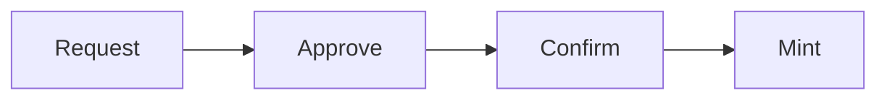
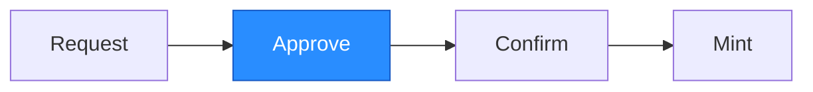
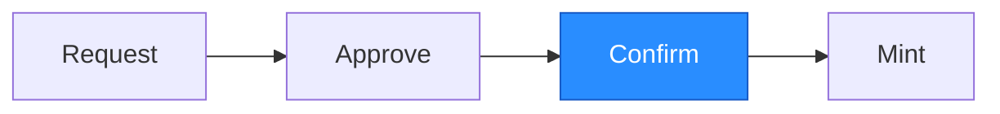
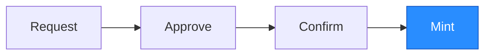

# Deposit

*[Documentation index](/hashi/design/llms.txt) · [Full index](/hashi/design/llms-full.txt)*

> How Hashi turns BTC sent to a deposit address into hBTC on Sui through the request, approve, confirm, and mint phases.

A deposit moves BTC from a user's Bitcoin wallet into the Hashi-managed UTXO
pool, minting a corresponding amount of `hBTC` into the user's account on Sui.
The process has four phases:



The split between **Approve** and **Confirm** introduces a configurable
time-delay window (see
[`bitcoin_deposit_time_delay_ms`](config.mdx#bitcoin_deposit_time_delay_ms))
between the moment the committee certifies a deposit and the moment funds are
minted. This delay gives operators a chance to detect a faulty or fraudulent
approval and pause the service before any `hBTC` is minted.

## Request


The user creates a Bitcoin transaction that sends BTC to a Hashi deposit
address. Each deposit address is a unique Taproot address derived from the
target destination address on Sui (see [Bitcoin Address Scheme](address-scheme.mdx)).
The deposit must meet the
[`bitcoin_deposit_minimum`](config.mdx#bitcoin_deposit_minimum), which is never
below the dust minimum (`546 sats`), to avoid creating unspendable UTXOs on
Bitcoin.

After the Bitcoin transaction is broadcast, the user notifies Hashi by
constructing a `Utxo` and calling `hashi::deposit::deposit` on Sui.

The `Utxo` is constructed from the Bitcoin transaction details:

```move
public fun utxo(
    utxo_id: UtxoId,
    amount: u64,
    derivation_path: Option<address>,
): Utxo

public fun utxo_id(
    txid: address,
    vout: u32,
): UtxoId
```

- `txid`: the 32-byte transaction hash in Bitcoin's internal byte order, the
  reverse of the hex txid that wallets and explorers show.
- `vout`: the output index within that transaction.
- `amount`: the deposit amount in satoshis.
- `derivation_path`: the Sui address used to derive the deposit address.

The user then submits it:

```move
entry fun deposit(
    hashi: &mut Hashi,
    utxo: Utxo,
    clock: &Clock,
    ctx: &mut TxContext,
)
```

The function checks that the service is not paused (deposits are accepted
during a reconfiguration), that the deposit meets the minimum amount, and that
the UTXO is not already in the pool, active or spent. It then creates a
`DepositRequest` and places it in the deposit queue. Committee members start
monitoring Bitcoin for confirmation.

## Approve



Committee members monitor the Bitcoin network for the deposit transaction. The
transaction must reach a sufficient number of block confirmations (see
[`bitcoin_confirmation_threshold`](config.mdx#bitcoin_confirmation_threshold))
before it is considered final. This guards against chain reorganizations where
a confirmed transaction could be reversed. If the transaction never reaches the
threshold, for example because a reorg drops it, the request is never
approved. A request that isn't confirmed expires 24 hours after it is created
and is then deleted; the user can submit the UTXO again.

After confirmation, on Bitcoin mainnet, each committee member with a TRM Labs
API key independently screens the deposit's Bitcoin transaction and Sui
recipient (see [Handling Sanctioned Addresses](sanctions.mdx)); other members
approve without screening. A member that rejects the deposit does not vote to
approve it.

After a node determines that a deposit request is both confirmed on Bitcoin
and passes its own screening checks, it communicates with the other members
of the Hashi committee and collects signatures from validators that agree the
deposit should be approved. If a quorum of validators cannot agree that a
deposit should be approved, the request is either retried later or ignored
if invalid.

After a quorum is reached, one validator submits the certificate onchain by
calling `hashi::deposit::approve_deposit`:

```move
entry fun approve_deposit(
    hashi: &mut Hashi,
    request_id: address,
    cert: CommitteeSignature,
    clock: &Clock,
    ctx: &mut TxContext,
)
```

The function aborts while the service is paused or a reconfiguration is
pending, if the UTXO is already in the pool, or if the current committee has
already approved the request. Otherwise it verifies the committee certificate
against the current committee and records both the certificate and the
current clock timestamp on the request. The request remains in the deposit
queue, and no `hBTC` is minted yet.

## Confirm



After approval, the deposit must wait through the configured time-delay
window (see
[`bitcoin_deposit_time_delay_ms`](config.mdx#bitcoin_deposit_time_delay_ms))
before it can be confirmed. The window gives operators a chance to detect a
faulty or fraudulent approval and pause the service before funds are minted.
While the service is paused, `approve_deposit` and `confirm_deposit` are both
rejected, so pending approvals stay parked in the queue until the system is
unpaused, unless the request expires first.

If the committee rotates before the deposit is confirmed, the existing
approval becomes invalid and the deposit must be re-approved by the new
committee, which restarts the delay. The onchain `confirm_deposit` re-verifies
the stored certificate against the current committee, not the committee that
originally approved it.

After the delay has elapsed, any caller may call `hashi::deposit::confirm_deposit`:

```move
entry fun confirm_deposit(
    hashi: &mut Hashi,
    request_id: address,
    clock: &Clock,
    ctx: &mut TxContext,
)
```

The function:

1. Aborts while the service is paused or a reconfiguration is pending, or if
   the UTXO is already in the pool (active or spent), before anything changes.
2. Re-verifies the stored committee certificate against the current committee.
3. Asserts that `approved_timestamp_ms + bitcoin_deposit_time_delay_ms <= now`.
4. Aborts if the request was never approved, the certificate no longer
   verifies, or the delay has not elapsed.

## Mint



After both checks in `confirm_deposit` pass, the function mints the
corresponding amount of `hBTC` and sends it to the Sui address in the UTXO's
`derivation_path` (a UTXO without one mints nothing). The
deposited UTXO is added to the Hashi-managed UTXO pool, making it available
for future withdrawal coin selection.
