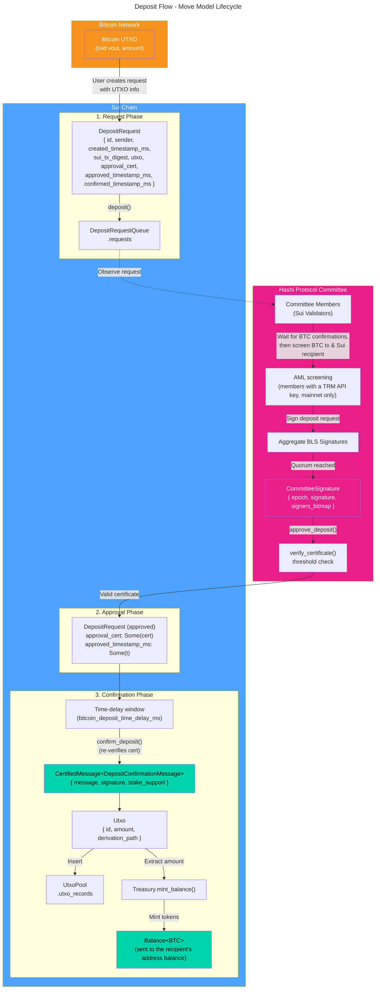

This document illustrates the lifecycle of key Move models in the deposit and
withdrawal flows, showing how data structures transform between onchain (Sui)
and offchain (Bitcoin) states.

## Entry-function gating principle

Every entry function that takes the `Hashi` object asserts the package
version is enabled. Beyond that, **pause and reconfiguration gate only the
deposit and withdrawal flows.** Deposit approval and confirmation, and
withdrawal approval, commitment, signing, and finalization, all stop when
governance pauses the system or while a committee handoff is pending; user
requests and withdrawal confirmation stop only for a pause, and cancelling a
withdrawal stops for neither. Reconfiguration, MPC certificate submission,
governance, cleanup entries (`cleanup_spent_utxos`,
`archive_confirmed_withdrawals`, `archive_withdrawal_requests`,
`finish_archive_withdrawal_txns`, `destroy_key_gen_certs`,
`destroy_nonce_certs`, `delete_expired_deposit`, `proposal::delete_expired`),
and validator registration or key rotation never check pause, because an
emergency pause must not block operators from maintaining nodes or the chain
from shedding dead state. Nodes themselves stop all leader work while paused,
garbage collection included, so during a pause that state is shed only by a
manual call. One asymmetry is intentional: users can *request* deposits and
withdrawals during reconfiguration (a withdrawal request only escrows their
hBTC); only committee approval, commitment, signing, and deposit confirmation
wait for the new committee.

## Deposit flow

### Deposit flow summary

| Step | Action                                           | Model Transformation                                                                  |
| ---- | ------------------------------------------------ | ------------------------------------------------------------------------------------- |
| 1    | User sends BTC to bridge address                 | Bitcoin UTXO created                                                                  |
| 2    | User calls `deposit()`                           | `DepositRequest` → `DepositRequestQueue`                                              |
| 3    | Committee members wait for Bitcoin confirmations | `bitcoin_confirmation_threshold` blocks on the deposit transaction                    |
| 4    | Committee members screen and sign request        | Members with a TRM API key screen it (mainnet only); BLS signatures aggregated → `CommitteeSignature` |
| 5    | Leader calls `approve_deposit()` with cert       | `verify_certificate()` → request stores `approval_cert` and `approved_timestamp_ms`   |
| 6    | Time-delay window elapses                        | `bitcoin_deposit_time_delay_ms` (a window to catch a faulty approval and pause before anything is minted) |
| 7    | Anyone calls `confirm_deposit()`                 | Re-`verify_certificate()` → `CertifiedMessage<DepositConfirmationMessage>`            |
| 8    | Treasury mints tokens                            | If the UTXO has a derivation path, `Utxo.amount` → `Balance<BTC>` sent to that address |
| 9    | Certified request processed                      | `Utxo` → `UtxoPool`; `DepositRequest` → `DepositRequestQueue.processed` with `confirmed_timestamp_ms` set |

---

## Withdrawal flow

```mermaid
---
title: Withdrawal Flow - Move Model Lifecycle
---
flowchart TD
    subgraph Sui["Sui Chain"]
        subgraph RequestPhase["1. Request Phase"]
            BAL["Balance&lt;BTC&gt;<br/>(User's tokens)"]
            WR["WithdrawalRequest<br/>{ id, btc_amount, bitcoin_address }"]
            WRQ["WithdrawalRequestQueue<br/>.requests"]
        end

        subgraph ProcessPhase["2. Processing Phase"]
            UTXO_POOL["UtxoPool<br/>"]
            BURN["Treasury.burn()"]
            PW["WithdrawalTransaction<br/>{ id, txid, request_ids, inputs,<br/>withdrawal_outputs, change_outputs,<br/>signing, guardian_signatures }"]
            PWQ["WithdrawalRequestQueue<br/>.withdrawal_txns"]
        end

        subgraph SignPhase["3. Signature Storage Phase"]
            SUBMIT_SIGS["commit_input_signatures()<br/>Store MPC sigs on-chain in chunks"]
            FINALIZE["finalize_withdrawal()<br/>Attach guardian sigs"]
            PW_SIGNED["WithdrawalTransaction<br/>(with signatures)"]
        end

        subgraph ConfirmPhase["4. Confirmation Phase"]
            CERTIFIED2["CertifiedMessage&lt;WithdrawalConfirmationMessage&gt;"]
            MOVE_CONFIRMED["Set confirmed_timestamp_ms<br/>(GC later moves it to .confirmed_txns)"]
            RECORD["Mark input UTXOs spent<br/>(GC later moves them to spent_utxos)"]
        end
    end

    subgraph Committee["Hashi Protocol Committee"]
        MEMBERS2["Committee Members<br/>(Sui Validators)"]
        SCREEN2["AML screening<br/>(members with a TRM API key, mainnet only)"]
        VOTE["Vote to process withdrawal<br/>& select UTXOs"]
        VAL["validate_consume()<br/>leader's read-only<br/>seq + capacity check"]
        MPC["MPC Signing Protocol"]
        BLS_GW["Aggregate BLS cert over<br/>StandardWithdrawalRequest<br/>(wid, seq, ts, utxos)"]
        LL["LocalLimiter<br/>(per-node cache:<br/>next_seq, tokens)"]
        SIGN2["Aggregate BLS Signatures"]
        CERT2["CommitteeSignature"]
    end

    subgraph Guardian["Hashi Guardian (off-chain rate limiter)"]
        GRL["RateLimiter<br/>{ next_seq,<br/>num_tokens_available, last_updated_at }"]
        STD_RPC["StandardWithdrawal RPC<br/>verifies committee cert,<br/>consumes from limiter,<br/>returns enclave signature"]
    end

    subgraph Bitcoin["Bitcoin Network"]
        BTC_TX["Bitcoin Transaction<br/>(signed via MPC)"]
        BTC_UTXO["Bitcoin UTXO<br/>(at destination)"]
    end

    BAL -->|"User deposits<br/>Balance&lt;BTC&gt;"| WR
    WR -->|"request_withdrawal()"| WRQ
    WRQ -.->|"Observe & approve<br/>request"| MEMBERS2
    MEMBERS2 -->|"Screen BTC destination<br/>& Sui requester"| SCREEN2
    SCREEN2 --> VOTE
    VOTE -.->|"Select UTXOs<br/>(off-chain)"| UTXO_POOL
    VOTE --> BURN
    BURN -->|"Balance&lt;BTC&gt; burned"| PW
    PW --> PWQ
    PWQ -.->|"Observe withdrawal<br/>transactions"| MPC
    MPC -->|"Schnorr witness signatures<br/>per input"| SUBMIT_SIGS
    SUBMIT_SIGS -.->|"all inputs signed"| VAL
    LL -.->|"current next_seq,<br/>capacity"| VAL
    VAL -->|"validation passes"| BLS_GW
    BLS_GW -->|"finalize_withdrawal_<br/>through_guardian"| STD_RPC
    STD_RPC -->|"consume(seq, ts, amt)"| GRL
    GRL -.->|"GetGuardianInfo<br/>(seed, then periodic reconcile)"| LL
    STD_RPC -->|"guardian signatures"| FINALIZE
    FINALIZE -->|"cert over MPC +<br/>guardian signatures"| PW_SIGNED
    PW_SIGNED -.->|"fully signed (object mirror):<br/>apply_consume(next_seq, ts, amt)"| LL
    PW_SIGNED -->|"Reconstruct & broadcast<br/>signed BTC tx"| BTC_TX
    BTC_TX --> BTC_UTXO
    BTC_UTXO -.->|"Observe confirmation<br/>(N confirmations)"| SIGN2
    SIGN2 --> CERT2
    CERT2 -->|"confirm_withdrawal()"| CERTIFIED2
    CERTIFIED2 --> MOVE_CONFIRMED
    MOVE_CONFIRMED --> RECORD

    style Bitcoin fill:#f7931a,color:#fff
    style Committee fill:#E91E8A,color:#fff
    style Sui fill:#4da2ff,color:#fff
    style Guardian fill:#7B1FA2,color:#fff
    style BAL fill:#00d4aa,color:#000
    style BTC_UTXO fill:#f7931a,color:#fff
    style CERT2 fill:#E91E8A,color:#fff
    style CERTIFIED2 fill:#00d4aa,color:#000
    style PW_SIGNED fill:#00d4aa,color:#000
    style MOVE_CONFIRMED fill:#00d4aa,color:#000
    style GRL fill:#7B1FA2,color:#fff
    style LL fill:#E91E8A,color:#fff
```

:::info

The Bitcoin confirmation threshold is stored onchain in the config key
`bitcoin_confirmation_threshold` (default `6`). Witness signatures are stored
onchain so that any leader can reconstruct and re-broadcast the signed
Bitcoin transaction without MPC re-signing (for example, after leader
rotation or mempool eviction).

**Limiter coordination.** The `LocalLimiter` on each committee node is a
deterministic projection of the onchain stream. Outside a reconcile (below),
its `next_seq` advances **only** when the node's object mirror sees a
`WithdrawalTransaction` become fully signed (the `finalize_withdrawal` write).
The finalize path uses `validate_consume` (read-only) to gate participation,
never to mutate state: the leader checks before it calls the guardian, and
each member checks again before it signs the finalize certificate. The
leader's flow only reaches `finalize_withdrawal()` after
`finalize_withdrawal_through_guardian` returns `Ok`, so seeing the transaction
become fully signed onchain is a sufficient proxy for the guardian having
acknowledged the request. The guardian advances its own `next_seq` when it
signs, so the local cache trails it while a withdrawal is in flight. On
startup, each node seeds its `LocalLimiter` through `GetGuardianInfo`, then
periodically reconciles against it, snapping back a cache that stalled or
drifted and adopting a new limiter policy after a guardian rotation.

:::

### Withdrawal flow summary

| Step | Action                                       | Model Transformation                                                         |
| ---- | -------------------------------------------- | ---------------------------------------------------------------------------- |
| 1    | User requests withdrawal                     | `Balance<BTC>` → `WithdrawalRequest` → `WithdrawalRequestQueue.requests`     |
| 2    | Committee screens and approves request       | Members with a TRM API key screen it (mainnet only); `approve_request()` records `approval_cert` on the request |
| 3    | Leader commits withdrawal tx                 | `Balance<BTC>` burned, `WithdrawalTransaction` created in `.withdrawal_txns` |
| 4    | MPC protocol signs Bitcoin transaction       | Committee signs each input via MPC; `commit_input_signatures()` stores the signatures onchain in chunks |
| 5    | Leader checks its `LocalLimiter`             | `LocalLimiter::validate_consume(seq, ts, amt)` (read-only) before calling the guardian |
| 6    | Leader BLS-certs `StandardWithdrawalRequest` | Aggregated cert over `(wid, seq, ts, utxos)` — input to the guardian RPC     |
| 7    | Guardian rate-limit check + enclave sig      | `StandardWithdrawal` RPC: verify cert → `consume(seq, ts, amt)` → enclave signatures |
| 8    | Leader finalizes with guardian signatures    | Members re-run `validate_consume` and certify both signature sets; `finalize_withdrawal()` attaches the guardian signatures |
| 9    | Each node advances its `LocalLimiter`        | Object mirror sees the tx become fully signed → `apply_consume(seq, ts, amt)` |
| 10   | BTC transaction broadcast (and re-broadcast) | Signed tx reconstructed from onchain data, broadcast to Bitcoin              |
| 11   | Committee signs confirmation certificate     | `CommitteeSignature` created after BTC tx confirmed                          |
| 12   | Leader confirms withdrawal                   | `confirmed_timestamp_ms` set, input UTXOs marked spent; the leader's GC later moves the tx to `.confirmed_txns`, its requests to `.processed`, and the spent inputs to `spent_utxos` |

---

## Key models reference

| Model                    | Location                                 | Description                                                            |
| ------------------------ | ---------------------------------------- | ---------------------------------------------------------------------- |
| `Balance<BTC>`           | User wallet                              | Wrapped BTC token on Sui                                               |
| `DepositRequest`         | `DepositRequestQueue.requests`, then `.processed` once confirmed | Deposit request with its approval cert and timestamps; deleted if it expires unconfirmed |
| `Utxo`                   | `UtxoPool`                               | Onchain representation of a Bitcoin UTXO                               |
| `WithdrawalRequest`      | `WithdrawalRequestQueue.requests`, then `.processed` once archived | User's withdrawal request with destination; `approval_cert` and `withdrawal_txn_id` mark approval and commitment |
| `WithdrawalTransaction`  | `WithdrawalRequestQueue.withdrawal_txns` | In-flight withdrawal tx (kept after confirmation until archived), stores inputs, outputs, and witness signatures |
| `WithdrawalTransaction`  | `WithdrawalRequestQueue.confirmed_txns`  | Confirmed withdrawal tx, moved here by the leader's archival GC (historical record) |
| `Bitcoin UTXO`           | Bitcoin Network                          | Actual unspent transaction output on Bitcoin                           |
| `Committee`              | `CommitteeSet`                           | BLS signing committee of Sui validators for an epoch                   |
| `CommitteeMember`        | `Committee.members`                      | Validator with public_key and voting weight                            |
| `CommitteeSignature`     | Built in the PTB by `committee::new_committee_signature`; stored as `approval_cert` on requests | Aggregated BLS signature with signers bitmap |
| `CertifiedMessage<T>`    | Verified onchain                         | Message proven to have committee quorum support                        |
