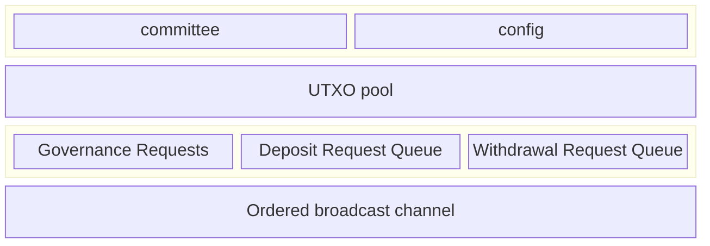

Every committee member is responsible for running a Hashi node service. Each
Hashi node exposes an HTTP service, secured by Transport Layer Security (TLS)
using a self-signed cert (each member registers its ed25519 public key in the
`CommitteeSet` on the `Hashi` object), and serves the gRPC `BridgeService` and
`MpcService`. Peers connect with their own registered TLS key, and the node
refuses any caller whose key belongs to no registered validator, except on
`/health` and `/ready`. The `/health` there always answers; liveness probes
should use the `/health` on the plain-HTTP metrics listener
(`metrics-http-address`, default `127.0.0.1:9180`) instead, which fails once
the node's main runtime stops running tasks for two minutes.

## Sui contracts

- The Hashi Move package is published as a normal package. It is not a system
  package and is not part of the Sui framework.

## Stateless

A main goal of this design is to make the Hashi service as stateless as
possible. Outside of any cryptographic material required for participating in
the protocol, any state critical for the functioning of the service must be
stored on Sui as part of the live object set. Knowledge of any historical
transactions or events previously emitted must not be needed for correct
operation of the service.

The set of data structures and state kept onchain is as follows:

