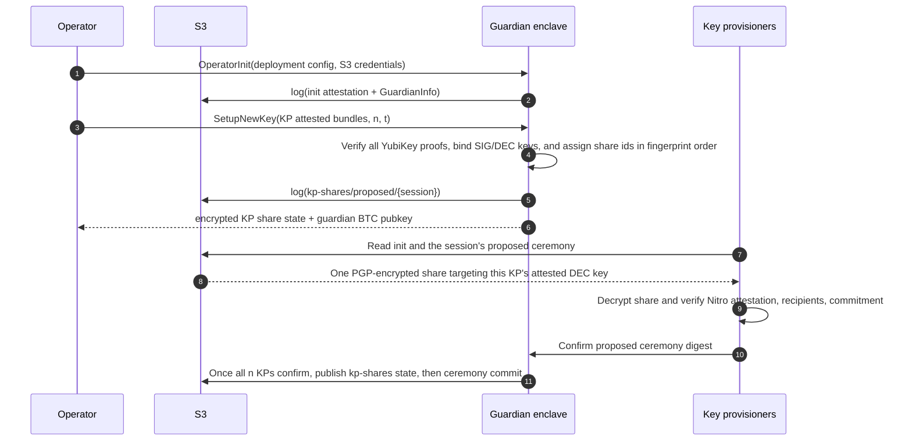
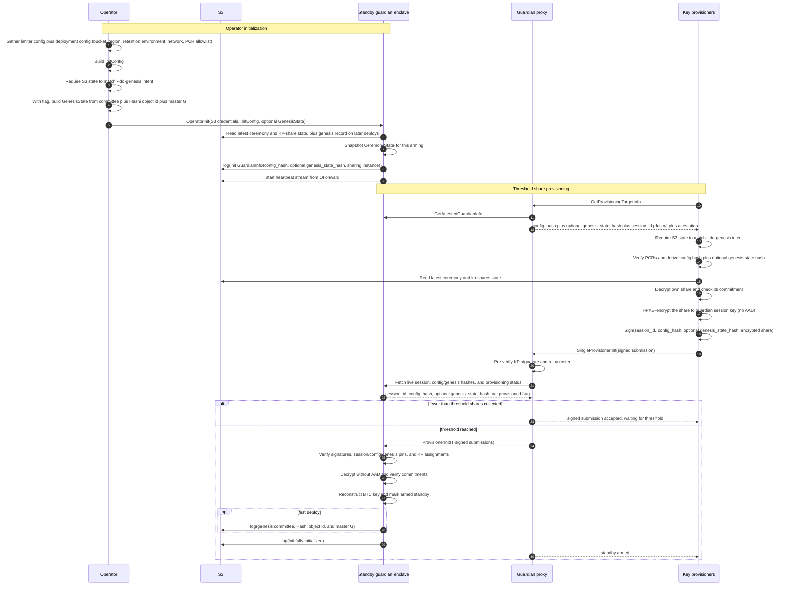
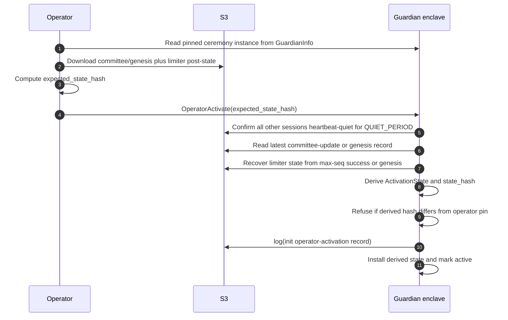
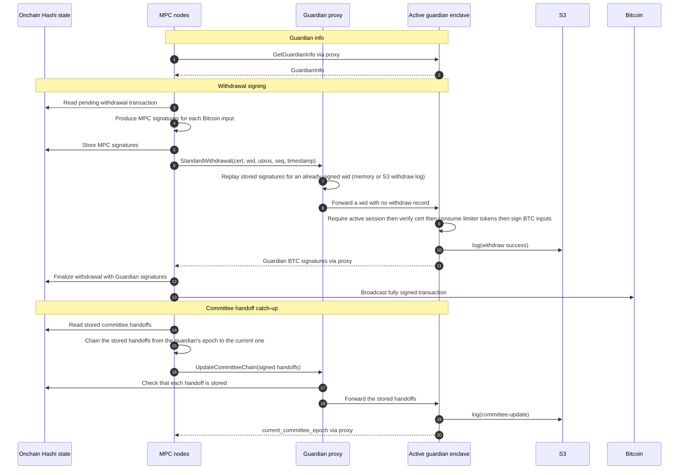

# Guardian

*[Documentation index](/hashi/design/llms.txt) · [Full index](/hashi/design/llms-full.txt)*

> The withdrawal Guardian is a second signatory on managed Bitcoin deposits, providing defense in depth against committee compromise.

To protect against vulnerabilities and against malicious past committees,
Hashi uses a withdrawal guardian: a second signatory on the managed Bitcoin
deposits. Deposits are spent with a 2-of-2 multisig where the guardian is one
party and the Hashi MPC committee is the other. A recovery script also lets the
MPC committee alone spend a UTXO 60 days after it confirms (see
[Bitcoin Address Scheme](address-scheme.mdx)).

## Components

The guardian integration has five distinct flows:

- **Ceremony mode** is the key-generation control-plane flow. The operator
  initializes a ceremony guardian, supplies the KP roster, and receives the
  guardian BTC public key plus encrypted KP shares.
- **Withdraw-mode provisioning** arms a standby withdrawal guardian while the
  current active guardian is still alive. The operator installs a stable
  `InitConfig`; each KP independently recomputes `config_hash` from its locally
  configured limiter config and deployment config (S3 bucket and region,
  retention environment, network, and PCR allowlist), requires it to match the
  enclave's, and submits threshold encrypted shares through the public relay.
- **Activation** is the operator-triggered takeover step. The standby enclave
  confirms a quiet window, derives live state from S3, checks the operator's
  expected state hash, records activation, and only then serves withdrawals.
- **Normal operation** is a data-plane flow. MPC nodes call the guardian proxy's
  node endpoint for guardian info, withdrawal signatures, and committee handoff
  updates.
- **KP rotation** re-deals the guardian key to a new KP set on a fresh ceremony
  guardian (`RotateKpSet`, then every new KP confirms), or replaces one KP's
  certificate (`ProvisionerRotateCert`).

The main components are:

- **MPC nodes**: the Hashi validator committee. Nodes collect committee
  certificates, run the MPC signer, and call the guardian for the second
  Bitcoin signature.
- **Guardian proxy**: the guardian's gRPC endpoints. The public one
  (`guardian_url`) serves `/info`, `GetGuardianInfo`, the attested info
  queries, and the key-provisioner RPCs (the share relay, `ConfirmCeremony`,
  and `ProvisionerRotateCert`); it never serves operator RPCs, which reach the
  enclave directly. Nodes call a separate one (`guardian_node_url`), which serves only
  `GetGuardianInfo` and node RPCs: the proxy terminates TLS itself and forwards
  node RPCs only for current or pending committee members, who present their
  registered TLS key as a client certificate. It forwards a committee handoff
  only once the chain stores it, which happens when its reconfiguration
  completes, so no node can move the guardian to a committee whose
  reconfiguration is later aborted. Both checks trust the proxy's Sui fullnode
  for chain state, and assume nodes cannot reach the enclave directly.
- **Guardian enclave**: the private signer and policy engine. A standby
  guardian stores static config and the reconstructed BTC key; an active
  guardian additionally verifies committee certificates, enforces the limiter,
  and signs Bitcoin inputs. Every session signs the records it writes to S3.
- **Key provisioners (KPs)**: independent holders of guardian key shares. Each
  share has one configured YubiKey-backed OpenPGP certificate and one encrypted
  ciphertext.
- **Operator**: the off-enclave actor that drives guardian ceremony and
  withdraw-mode provisioning and activation.
- **S3**: signed log storage under Object Lock for init (attestation and
  session lifecycle), heartbeat, ceremony proposal, ceremony, KP-share,
  genesis, withdrawal, and committee-update records. Heartbeats, ceremony
  proposals, and KP shares get only a short lock. Activation records are
  session lifecycle records in the activating session's init log.
- **Onchain Hashi state**: the source of committee, config, withdrawal, and MPC
  key state used by nodes and initialization tooling.

## Ceremony mode flow

Before the ceremony, each KP provides its public OpenPGP certificate, fingerprint
text file, and three matching PEM sidecars. See the
[KP provisioning guide](https://github.com/MystenLabs/hashi/blob/main/key-provisioner/provision.md#setting-up-your-yubikey)
for device requirements, output filenames, and attestation policy.

Configuration still contains only `.asc` paths. All matching sidecars must be
colocated on every certificate-loading host, including for signers and replacement
certificates. The CLI verifies and sends bundles; the guardian independently
rejects missing or invalid proofs on every certificate-bearing RPC.
The sole usable signing key must be the SIG-attested primary key, so the KP's
primary-key fingerprint identifies its attested signing key. Certificates with
a separate signing subkey under an unattested primary are rejected.
Signature verification pins that signing key; encryption and recipient checks
pin the attested DEC key. Each share ciphertext must contain exactly one
OpenPGP recipient matching that DEC key.
YubiKey provenance checks are separate from the guardian's Nitro attestation
in its S3 init log.

## Guardian info queries

`GetGuardianInfo` returns the guardian's self-reported state, with no
signature or attestation. The proxy caches these responses for 30 seconds and
drops the cache after each signed withdrawal; the public HTTP `/info` view
keeps its own cache (`INFO_CACHE_TTL_MS`, 30 seconds by default).

KPs and operators use `GetAttestedGuardianInfo` to receive signed guardian state
alongside a fresh Nitro attestation. Attested responses are never cached.
`GetProvisioningTargetInfo` forwards to that RPC on the provisioning guardian
(the standby when configured, otherwise the active guardian), also without caching.

The distinct RPC paths allow deployments to restrict attestation queries while
leaving ordinary info public. The proxy does not itself add authentication for
these queries: an access policy must cover both `GetAttestedGuardianInfo` and
`GetProvisioningTargetInfo`.

Clients that previously set `include_attestation` on `GetGuardianInfo` must switch
to `GetAttestedGuardianInfo`. Ordinary info no longer returns an attestation or a signature. Upgrade the guardian and proxy before
switching KP/operator clients to the new RPC.

## Withdraw-mode provisioning flow

On first deploy, the operator and every KP pass `--do-genesis`. This is purely an
explicit intent marker: callers fail if it disagrees with the observed S3
committee state. The operator pins the current onchain committee, configured
Hashi object id, and MPC master `G` as an optional `GenesisState` during
`OperatorInit`, and each KP independently derives its hash and includes it in
the normal signed PI submission. Once PI reaches threshold, the enclave writes
the committee, Hashi object id, and master `G` to `genesis/record.json`. Later
deploys use `None` and do not pass the flag; their enclave loads the Hashi
object id and master `G` from `genesis/record.json` instead.

## Standby activation flow

## Normal operation flow

