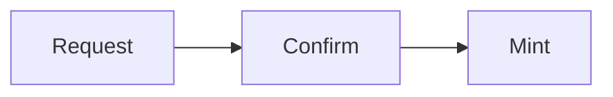
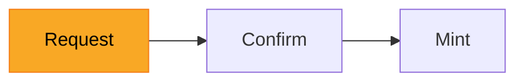
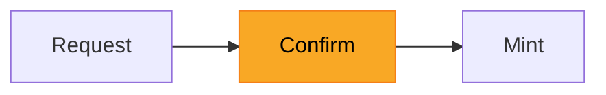
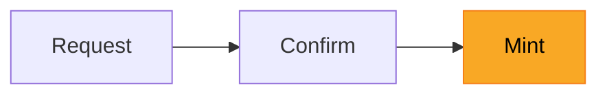

# Deposit

A deposit moves BTC from a user's Bitcoin wallet into the Hashi-managed UTXO
pool, minting a corresponding amount of `hBTC` into the user's account on Sui.
The process has three phases:



## Request



The user creates a Bitcoin transaction that sends BTC to a Hashi deposit
address. Each deposit address is a unique Taproot address derived from the
target destination address on Sui (see [address scheme](./address-scheme.md)).
The deposit must meet the dust minimum (`546 sats`) to avoid creating
unspendable UTXOs on Bitcoin.

Once the Bitcoin transaction is broadcast, the user notifies Hashi by
constructing a `DepositRequest` and calling `hashi::deposit::deposit` on Sui.

First, the user creates the request by calling `hashi::deposit_queue::deposit_request`:

```move
public fun deposit_request(
    utxo: Utxo,
    clock: &Clock,
    ctx: &mut TxContext,
): DepositRequest
```

The `Utxo` is constructed from the Bitcoin transaction details:

```move
public fun utxo(
    utxo_id: UtxoId,
    amount: u64,
    derivation_path: Option<address>,
): Utxo

public fun utxo_id(
    txid: address,
    vout: u32,
): UtxoId
```

- `txid` -- the 32-byte Bitcoin transaction hash
- `vout` -- the output index within that transaction
- `amount` -- the deposit amount in satoshis
- `derivation_path` -- the Sui address used to derive the deposit address

The user then submits the request:

```move
public fun deposit(
    hashi: &mut Hashi,
    utxo: Utxo,
    clock: &Clock,
    ctx: &mut TxContext,
)
```

The function validates that the deposit meets the minimum amount and the UTXO
has not been previously deposited. The request is then placed in the deposit
queue for committee members to begin monitoring for confirmation on Bitcoin.


## Confirm



Committee members monitor the Bitcoin network for the deposit transaction. The
transaction must reach a sufficient number of block confirmations (see
[`bitcoin_confirmation_threshold`](./config.md#bitcoin_confirmation_threshold))
before it is considered final. This guards against chain reorganizations where
a confirmed transaction could be reversed. If the transaction is never
confirmed or is invalidated by a reorg, the deposit is ignored.

Once confirmed, each committee member independently screens the deposit's
source address by making a request to its configured sanctions-checking
endpoint (see [handling sanctions](./sanctions.md)). A member that considers
the address sanctioned will not vote to accept the deposit.

Once a node has determined that a deposit request is both confirmed on bitcoin
and passes its own screening checks, it will communicate with the other members
of the hashi committee and collect signatures from validators who agree that
the deposit should be confirmed. If a quorum of validators cannot agree that a
deposit should be confirmed, it will either be retried at a later point or
ignored if the request is invalid.

## Mint



Once a quorum of validators have agreed that a deposit should be confirmed,
one validator submits the certificate on-chain by calling `hashi::deposit::confirm_deposit`:

```move
public fun confirm_deposit(
    hashi: &mut Hashi,
    request_id: address,
    signature: CommitteeSignature,
    ctx: &mut TxContext,
)
```

The function verifies the committee certificate, removes the request from the
deposit queue, mints the corresponding amount of `hBTC`, and sends it to the
user's Sui address. The deposited UTXO is added to the Hashi-managed UTXO
pool, making it available for future withdrawal coin selection.
