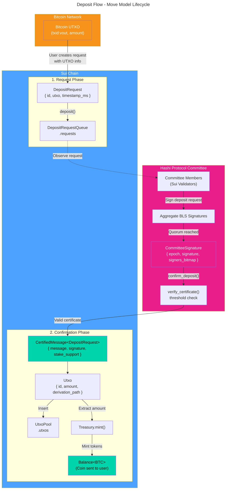
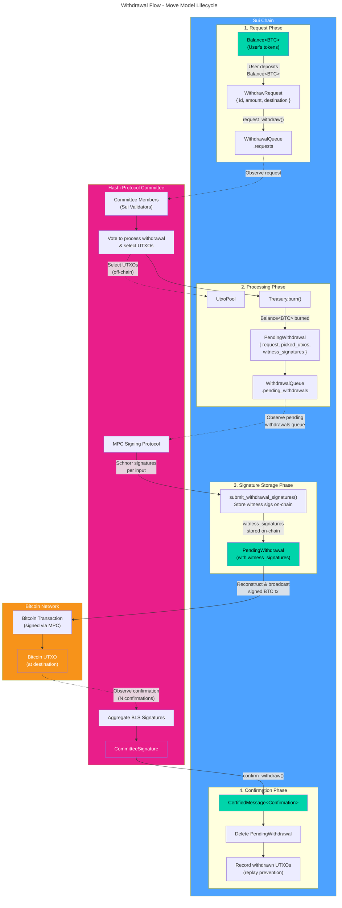

# Move Model Lifecycle

This document illustrates the lifecycle of key Move models in the deposit and withdrawal flows, showing how data structures transform between on-chain (Sui) and off-chain (Bitcoin) states.

## Deposit Flow

### Deposit Flow Summary

| Step | Action                                     | Model Transformation                                        |
| ---- | ------------------------------------------ | ----------------------------------------------------------- |
| 1    | User sends BTC to bridge address           | Bitcoin UTXO created                                        |
| 2    | User calls `deposit()`                     | `DepositRequest` → `DepositRequestQueue`                    |
| 3    | Committee members observe and sign request | BLS signatures aggregated → `CommitteeSignature`            |
| 4    | Leader calls `confirm_deposit()` with cert | `verify_certificate()` → `CertifiedMessage<DepositRequest>` |
| 5    | Certified request processed                | `DepositRequest` → `Utxo` in `UtxoPool`                     |
| 6    | Treasury mints tokens                      | `Utxo.amount` → `Balance<BTC>` to user                      |

---

## Withdrawal Flow

> **Note:** The Bitcoin confirmation threshold is stored on-chain in config key `bitcoin_confirmation_threshold` (default `6`). Witness signatures are stored on-chain so that any leader can reconstruct and re-broadcast the signed Bitcoin transaction without MPC re-signing (e.g., after leader rotation or mempool eviction).

### Withdrawal Flow Summary

| Step | Action                                       | Model Transformation                                             |
| ---- | -------------------------------------------- | ---------------------------------------------------------------- |
| 1    | User requests withdrawal                     | `Balance<BTC>` → `WithdrawRequest` → `WithdrawalQueue.requests`  |
| 2    | Committee votes & selects UTXOs              | Quorum votes, reads `UtxoPool` (off-chain) to select UTXOs       |
| 3    | Leader processes request                     | `Balance<BTC>` burned, `PendingWithdrawal` created               |
| 4    | MPC protocol signs Bitcoin transaction       | Committee collectively signs via MPC using selected UTXOs        |
| 5    | Leader stores witness signatures on-chain    | `submit_withdrawal_signatures()` → `PendingWithdrawal` updated   |
| 6    | BTC transaction broadcast (and re-broadcast) | Signed tx reconstructed from on-chain data, broadcast to Bitcoin |
| 7    | Committee signs confirmation certificate     | `CommitteeSignature` created after BTC tx confirmed              |
| 8    | Leader confirms withdrawal                   | `CertifiedMessage` verified, `PendingWithdrawal` deleted         |
| 9    | Record withdrawn UTXOs                       | Spent UTXOs recorded for replay prevention                       |

---

## Key Models Reference

| Model                 | Location                              | Description                                                            |
| --------------------- | ------------------------------------- | ---------------------------------------------------------------------- |
| `Balance<BTC>`        | User wallet                           | Wrapped BTC token on Sui                                               |
| `DepositRequest`      | `DepositRequestQueue`                 | Pending deposit awaiting committee confirmation                        |
| `Utxo`                | `UtxoPool`                            | On-chain representation of a Bitcoin UTXO                              |
| `WithdrawRequest`     | `WithdrawalQueue.requests`            | User's withdrawal request with destination                             |
| `PendingWithdrawal`   | `WithdrawalQueue.pending_withdrawals` | Withdrawal being processed, stores picked UTXOs and witness signatures |
| `Bitcoin UTXO`        | Bitcoin Network                       | Actual unspent transaction output on Bitcoin                           |
| `Committee`           | `CommitteeSet`                        | BLS signing committee of Sui validators for an epoch                   |
| `CommitteeMember`     | `Committee.members`                   | Validator with public_key and voting weight                            |
| `CommitteeSignature`  | Transaction input                     | Aggregated BLS signature with signers bitmap                           |
| `CertifiedMessage<T>` | Verified on-chain                     | Message proven to have committee quorum support                        |
